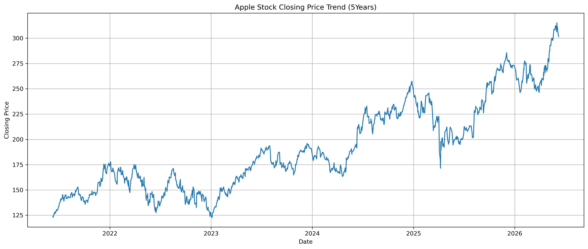
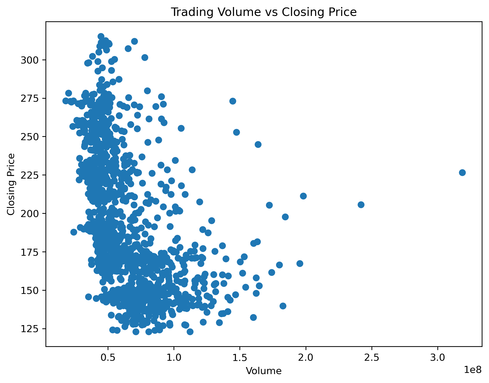
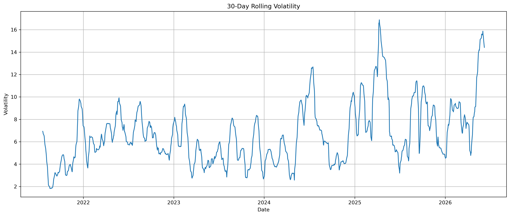

# Apple-Stock-Time-Series-Analysis
Time analysis done on AAPL stocks from 2021 to 2026.
# PROJECT OVERVIEW
Used this dataset to strengthen my ability to manipulate data, perform time-series analysis, and engineer features that help uncover meaningful insights from real-world data. Time analysis matter because it enables analysts to examine patterns and trends in data over time. In financial markets, it is widely used to evaluate stock performance, measure volatility, identify market trends, and support investment and business decision-making.Time-series analysis enables analysts to examine patterns and trends in data over time. In financial markets, it is widely used to evaluate stock performance, measure volatility, identify market trends, and support investment and business decision-making.

# OBJECTIVE
To apply advanced Python techniques for data transformation, time-series analysis, and feature engineering using historical stock market data.

# TOOLS USED
* Python
* Jupyter Notebook
* yfinance
* Pandas
* Matplotlib
* NumPy

# WORK FLOW
* Data collection using yfinance.
* Data exploration.
* Data transformation.
* Time series analysis.
* Featured engineering.
* Visualization.
* Key findings& Conclusion.

# VISUALIZATION

## Monthly Returns

Insight: The data shows significant volatility, with frequent fluctuations between positive and negative monthly performance throughout the period.

## Moving Average

Insight: This indicator successfully smooths price noise, clearly illustrating a sustained upward trend that might be obscured by daily price swings.
## Stock Price

Insight: The overall trajectory shows long term growth, with ending price being substantially higher than the starting price despite several intermediate pullbacks.
## Trading Volume

Insight: There are distinct, irregular spikes in activity, likely corresponding to major news events or earnings reports that triggered high market participation.
## Trading vs Closing

Insight: This scatter plot suggests a concentration of high volume at lower price points, with trading activity generally thinning out as the stock price reaches its peak.
## Volatility

Insight: The chart reveals that the stock experienced its highest level of price instability in late 2024 to early 2025, where volatility peaked near the 16% mark.

# KEY FINDINGS
* Apple experienced 143.3% growth within the five years period.
* There is a moderate level of daily gain and loss.
* The moving averages effectively smoothed daily fluctuations, making the long-term upward trend more apparent.
* Through the years each month either gave a positive or negative performance which is normal for the stock market.
* Volatility showed periods of increased market uncertainty and price instability.

